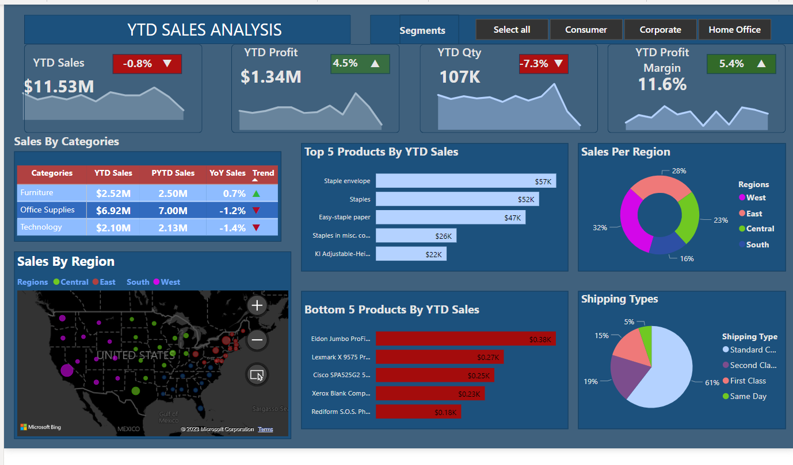

## Sales Analysis Of Prostar Retail Limited
A repository to showcase the analysis of a retail company's performance using their sales records and across different regions. 

**Introduction**

The project is to analyze and derive insights regarding the sales, revenue, and performance of the store using data and to also help in making data-driven decisions for management.

**Disclaimer**: All data sets and reports do not represent any company institution or country but are just a dummy dataset to demonstrate the capabilities of Power BI as a visualization tool.

**Problem Statement**
A US Based E-commerce Outlet is requesting a sales dashboard showing information on YTD sales and insights for the following KPIs:
-KPIs for YTD Sales, YTD Profit, YTD Quantity sold, YTD Profit Margin
- Year-on-year growth for each KPI using a YTD sparkline for each measure in the KPI to understand the monthly trend for each measure.
- Find YTD Sales, PYTD Sales, and YoY Sales growth for each customer category. Add an append icon for each category
- YTD Sales performance for each state
- Top 5 and Bottom 5 products By sales
- YTD Sales by Region to determine best performing and worst performing region
- YTD Sales BY Shipping type to determine the best shipping type percentage.

**Skills/ Concepts Demonstrated**  
**Power BI**
- Data cleaning using Power Query
- Time Intelligence functions
- Dynamic and complex KPIs
- DAX Queries using different functions 
- Conditional Formatting
- QUICK Measures
- Modelling
- Filters
- Generating insights from charts

**SQL**
 - Data cleaning
 - Common Table Enquiries (CTEs)
  
**Modelling**
Automatically derived relationships are adjusted to remove and replace unwanted relationships and the relationships between the tables are clearly mapped out.

**Adjusted Model**               | **Auto Model**
:-------------------------------:|:----------------------------------:
          |

The model is a star schema. There are 5-dimensional tables and 1 fact table. The dimension tables are all joined to the fact table with a one-to-many relationship.

## Visualization

## Insights 
From the above visualization, we can see that the company generated total revenue of $ 11.83 million which was 0.83% less than the previous year. However, there was an increase in profit and profit margin of 4.5% and 5.4% respectively because of the slight increase in product prices. 
We can also see that the top-selling products in terms of total sales are 'Staples', 'Staple envelopes', 'Easy-staple paper', 'KI Adjustable-Height Table', and 'Avery Non-Stick Binders, making it obvious that the office supplies category had the most sales. 
The sales over time show a somewhat consistent pattern, with some noticeable peaks and troughs. Further analysis may reveal if these peaks and troughs correspond to specific events or periods (like holidays, promotional events, etc). Similarly, profit over time also shows a somewhat consistent pattern, with some noticeable peaks and troughs.
The 'Consumer' segment generates the highest total sales and profit, followed by the 'Corporate' and 'Home Office' segments.
An analysis of sales per region shows that the western region had the most sales while the southern region had the least sales. This could be due to the marketing campaign which focused on the western region. 

## Recommendations
- Marketing strategies should be focused on promoting and stocking the top-selling and most profitable products, while the bottom five products can be scrapped. 
- A more in-depth investigation should be done in order to understand  the reasons behind the peaks and troughs in sales and profit over time and see if these can be leveraged to increase sales and profit.
- Given that the 'Consumer' segment generates the highest sales and profits, we should consider developing targeted marketing strategies for this segment. However, also consider ways to increase sales and profits from the 'Corporate' and 'Home’ segments also

**Customer Segment-Specific Recommendations**
-Consumer Segment: As this is the segment with the highest sales and profits, We recommend a continuous targeting of customers in  this segment with marketing and sales strategies. 
- Loyalty programs or referral incentives should be offered  to encourage repeat purchases and attract new customers.
- Corporate Segment: To increase sales in this segment, We recommend  offering bulk purchase discounts or contract pricing for larger orders. This should be tailored with  the product offerings to meet the needs of businesses, such as office supplies or technology products. We should also have dedicated account managers to handle corporate clients for personalized service.
- Home Office Segment: This segment could be targeted with products and offers specifically designed for home office setups. With the rise of remote working, there is potential for growth in this segment. Offering bundle deals on products commonly used in home offices could encourage larger orders.

**General Recommendations** 
Cross-Selling and Upselling: Implement strategies to increase the average order value, such as cross-selling (suggesting related products) and upselling (suggesting higher-value alternatives).
Seasonal Promotions: Coordinate sales and promotions with seasons or events when demand for certain products may increase. For example, back-to-school season could increase demand for office supplies, while holidays might increase demand for technology products as gifts.
Data Analysis: Continue analyzing sales data regularly to identify trends and make data-driven decisions. Monitor the effectiveness of different strategies and make adjustments as necessary.

In conclusion, while these recommendations aim to increase sales by targeting specific customer segments with tailored offerings and using strategies that encourage larger purchases. It's important to monitor the results of these strategies and adjust them as necessary based on their performance and changing market conditions.

**Credit: @Data Tutorials**

