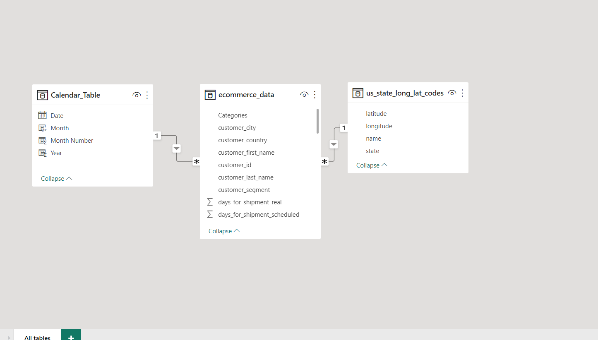

## Sales Analysis Of Prostar Retail Limited
A repository to showcase the analysis of a retail company's performance using their sales records and across different regions. 

Introduction 

The project is to analyze and derive insights regarding the sales, revenue, and performance of the store using data and to also help in making data-driven decisions for management.

**Disclaimer**: All data sets and reports do not represent any company institution or country but are just a dummy dataset to demonstrate the capabilities of Power BI as a visualization tool.

Problem Statement
A US Based E-commerce Outlet is requesting a sales dashboard showing information on YTD sales and insights for the following KPIs

-KPIs for YTD Sales, YTD Profit, YTD Quantity sold, YTD Profit Margin
- Year on Year Growth for each KPI using a YTD sparkline for each measure in the KPI to understand the monthly trend for each measure.
- Find YTD Sales, PYTD Sales, and YoY Sales growth for each customer category. Add an append icon for each category
- YTD Sales performance for each state
- Top 5 and Bottom 5 products By sales
- YTD Sales by Region to determine best performing and worst performing region
- YTD Sales BY Shipping type to determine the best shipping type percentage.

**Skills/ Concepts Demonstrated**  
**Power BI**
- Data cleaning using Power Query
- Time Intelligence functions
- Dynamic and complex KPIs
- DAX Queries using different functions 
- Conditional Formatting
- QUICK Measures
- Modelling
- Filters
- Generating insights from charts

**SQL**
 - Data cleaning
 - Common Table Enquiries (CTEs)
  
**Modelling**
Automatically derived relationships are adjusted to remove and replace unwanted relationships and the relationships between the tables are clearly mapped out.

**Adjusted Model**               | **Auto Model**
:-------------------------------:|:----------------------------------:
          |

The model is a star schema. There are 5-dimensional tables and 1 fact table. The dimension tables are all joined to the fact table with a one-to-many relationship.

## Visualization

